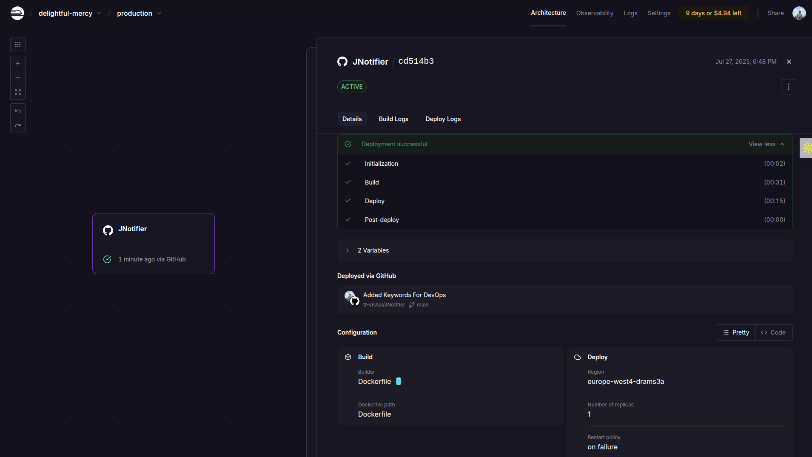

# 🚀 JNotifier - Job Hunter Bot (DevOps Showcase)

A **DevOps-ready Job Hunter Bot** built with **Go**, **Docker**, and deployed on **Railway**. This project not only automates job searching and **Discord notifications** but also demonstrates practical **DevOps, CI/CD, and cloud deployment** skills.

---

## 🎯 Key Highlights

* ✅ **Infrastructure as Code**: Full Docker-based deployment
* ✅ **CI/CD**: Auto-deployment with Railway from GitHub
* ✅ **Cloud-Native**: Runs on Railway (can be deployed to AWS, Azure, Fly.io, etc.)
* ✅ **Observability**: Centralized logging with Railway's dashboard
* ✅ **Environment Management**: `.env` & Railway Variables for secure secrets
* ✅ **Lightweight Microservice**: Efficient Go code using concurrency (goroutines)

---

## 🔧 Tech Stack

| Technology             | Purpose                              |
| ---------------------- | ------------------------------------ |
| **Go (Golang)**        | Core service, concurrency, API calls |
| **Docker**             | Containerization                     |
| **Railway**            | Cloud hosting, auto-deployments      |
| **Discord Webhooks**   | Notification delivery                |
| **RapidAPI (JSearch)** | Job search API                       |

---

## 🏗 Project Structure (DevOps Friendly)

```
project-root/
├── cmd/
│   └── bot/main.go          # Entry point
├── internal/
│   ├── api/                 # External API calls
│   ├── discord/             # Discord notifications
│   ├── models/              # Data models
│   ├── scheduler/           # Job scheduling
│   └── utils/               # Utility functions
├── Dockerfile
├── go.mod
└── .env (ignored in prod)
```

---

## 🐳 Docker Usage

**Dockerfile:** Defines how to build and run the bot inside containers.

Run locally:

```bash
# Build the image
docker build -t jnotifier .

# Run the container with environment variables
docker run -d \
  -e DISCORD_WEBHOOK=your_webhook_url \
  -e RAPIDAPI_KEY=your_rapidapi_key \
  jnotifier
```

---

## ☁️ Cloud Deployment (Railway CI/CD)

### Why Railway?

* Auto-deploy on every GitHub push 🚀
* Built-in build system (no need for Docker Hub)
* Environment Variables for secrets

### Deployment Steps:

1. Push your code to **GitHub**.
2. Create a new **Railway Project** → Deploy from GitHub → Select **Dockerfile** option.
3. Add **DISCORD\_WEBHOOK** and **RAPIDAPI\_KEY** in Railway's **Environment Variables**.
4. Every push = automatic deployment.



---

## 🔄 Automated Scheduler

The bot automatically runs **every 10 hours**:

```go
const jobInterval = 10 * time.Hour
```

You can change this in `scheduler.go`.

---

## 🔑 Security & Secrets

* Local dev: `.env` file
```# Create .env file in root directory of this project with variables
- RAPIDAPI_KEY
- DISCORD_WEEBHOOK
```
* Production: Railway **Environment Variables**
* **Never hardcode secrets** (DevOps best practice)

---

## 🚨 Cost Control (DevOps Responsibility)

| Service      | Cost Risk?                | Mitigation          |
| ------------ | ------------------------- | ------------------- |
| **Railway**  | Free for 500 hours/month  | Optimized intervals |
| **RapidAPI** | Free tier up to 100 calls | 10-hour scheduler   |
| **Discord**  | Free Webhooks             | No limits           |

---

## 📈 DevOps Learning Value:

* ✅ Docker
* ✅ Environment Variables
* ✅ CI/CD with Railway
* ✅ Log Monitoring & Debugging
* ✅ Infrastructure Cost Awareness
* ✅ API Rate Limiting & Scheduling

---

## 📣 Showcase Potential:

* 💼 Add to **LinkedIn Portfolio** as "DevOps Project"
* 💻 Mention **CI/CD, Cloud, Docker, and Automation**
* 🔗 Public GitHub repo for recruiters

---

## 👨‍💻 Author

Made with ☕ and 🚀 by **@tf-vishal**

---

🔥 Ready to help you hunt jobs **and** flex your **DevOps chops**!
